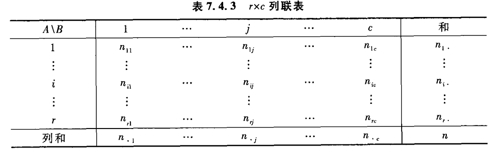
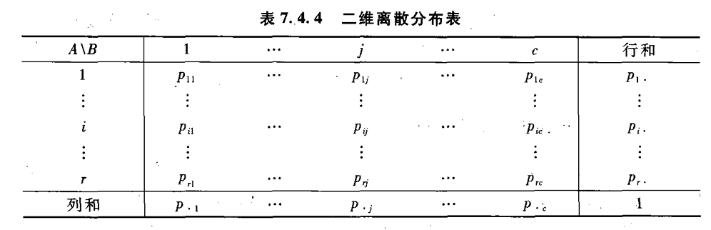

# 7.4 似然比检验

## 7.4.2 分类数据的$\chi^2$拟合优度检验

分类数据的检验，假设为：
$$
H_0: A_i 所占的比率是p_{i0},i=1,\cdots,r,
$$
其中$p_{i0}$已知，满足$\sum_{i=1}^r p_{i0}=1$，记$x_1,\cdots,x_n$为此总体抽出的样本，且以$n_i$记这$n$个样本中属于$A_i$的样本个数，由于当$H_0$成立时，在$n$个样本中属于$A_i$类的期望个数为$np_{i0}$，而观测到的值为$n_i$，则当假设成立时，二者应该相差不大，于是皮尔逊提出一个新的统计量来衡量理论个数与实际个数间的差异。

### 皮尔逊统计量

$$
\chi^2 = \sum_{i=1}^r \frac{(n_i-np_{i0})^2}{np_{i0}}
$$

​	分子是实际观测与理论个数差的平方，分母用于规范化，则拒绝域为$\{\chi^2\ge c\}$,皮尔逊证明了如下定理：

#### 定理7.4.1

​	在前述各项假定下，在$H_0$成立时，对皮尔逊统计量有:
$$
\chi^2 \rightarrow \chi^2(r-1)
$$
​	证明在pad的p390上，那么可采取显著性水平近似为$\alpha$的显著性检验，其拒绝域为：
$$
W=\{\chi^2 \ge \chi^2_{1-\alpha} (r-1)\}
$$
​	被称为皮尔逊$\chi^2$拟合优度检验

皮尔逊似然比检验 （p391）

## 7.4.3 分布的$\chi^2$拟合优度检验

​	有时，需要验证的原假设是：
$$
H_0: F(x)=F_0(x)
$$
​	其中$F_0(x)$称为理论分布，它可以是一个完全已知的分布，也可以是仅依赖于有限个实参数且分布形式已知的分布函数。

​	分为两种情况来讨论：

### 一、总体X为离散分布

​	则X总是落入某一类里，假设可转化为：
$$
H_0: A_i所占的比例为p_i(i=1,2,\cdots,r)
$$
​	与之前的分类数据检验问题一样。

​	注意卡方分布$\chi^2$的自由度判断，自由度为$r-n-1$，其中$n$为参数个数

### 二、总体X为连续分布

​	一般采用下列方法：选取$r-1$个实数$a_1\lt a_2\lt \cdots \lt a_{r-1}$，将实数族分为$r$个区间：
$$
(-\infty,a_1],(a_1,a_2],\cdots,(a_{r-1},\infty)
$$
​	当观测值落入第$i$哥区间时，将其看作第$i$类，则$r$个区间就相当于$r$个类，后续做法一致，同样注意卡方分布自由度的计算。

## 7.4.4 列联表的独立性检验

​	一般，若总体的属性分为$A,B$,前者有$r$个类，后者有$c$个类，可做一个如上图所示的列联表。可依此计算出各自类别的概率：

​	至此，A、B两属性独立的假设可转换为：
$$
H_0: p_{ij}=p_{i\cdot}p_{\cdot j}
$$
​	总共有$rc$个概率，由$r+c$个参数$p_{1\cdot},\cdots,p_{r\cdot}$决定，这r+c个参数有两个约束$\sum p_{i\cdot}=1,\sum p_{\cdot j}=1$,所以实际上由$r+c-2$个参数决定。检验统计量为：
$$
\chi ^2 =\sum_{i=1}^r\sum_{j=1}^c \frac{n_{ij}-n\hat p_{ij}}{n\hat p_{ij}}
$$
​	在原假设$H_0$成立时，近似服从自由度为$rc-(r+c-2)-1=(r-1)(c-1)$的$\chi^2$分布，其中的概率$\hat p_{ij}$是假设成立时得到的最大似然估计，其表达式为：
$$
\hat p_{ij}=\hat p_{i\cdot}\hat p_{j\cdot}=\frac {n_{i\cdot}}n \cdot \frac{n_{\cdot j}}n
$$
​	对于给定的显著性水平$\alpha(0\lt \alpha \lt 1)$，检验的拒绝域为$W=\{\chi^2 \ge \chi^2_{1-\alpha}((r-1)(c-1)\}$

